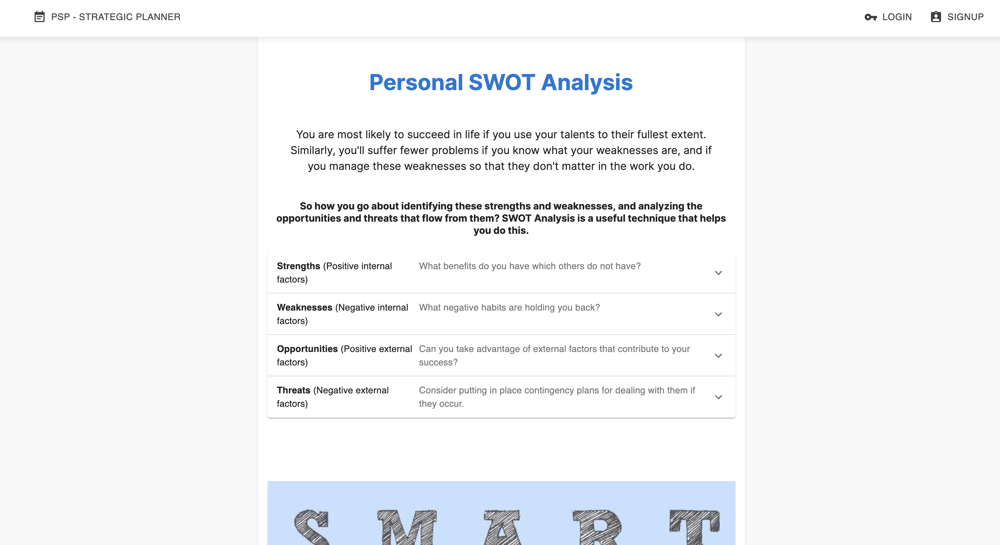

# Personal Strategic Planner(PSP)

## Overview

PSP is an interactive full-stack MERN application, where user can learn and practice how to set up goals in life using SWOT personal analysis, SMART criteria and LIFE WHEEL BALANCE. 
User can add Areas of life and inside every area he can add goals as much a he wants and work on it go back to it delete it when he's done with it, a complete control of his life.

## Technologies used

* Front-End : react was used for the front end with ityped npm and material ui for styling and making it more interactive.

* Back-End : Node.js, and Express was used on server side, apolloserver as middleware. 

* Data-base :  I used MongoDB to store data.

* Security : I used JWT for authentification.

* Deploy :  deployed the application to Heroku

## Image of home application

## Link to deployed application

https://mighty-inlet-79534.herokuapp.com/